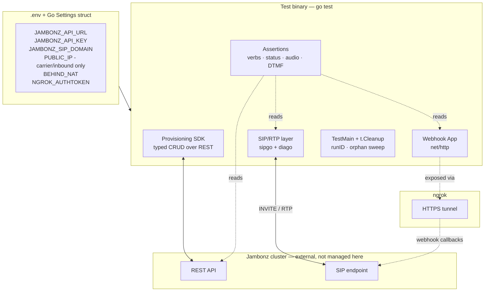
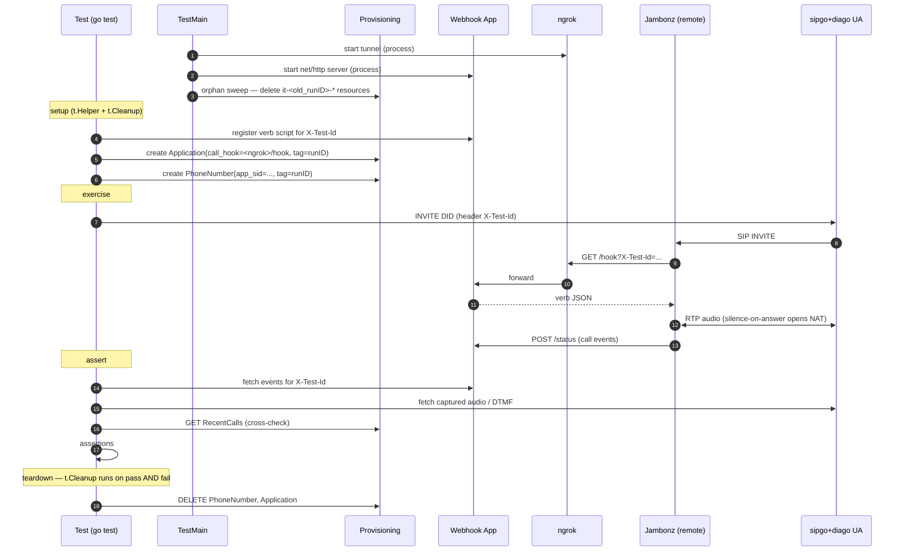
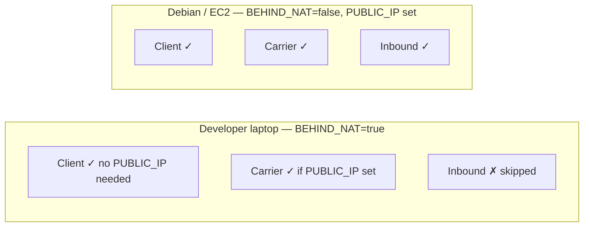

# smoke-tester — Architecture (Draft v0.2 — Go)

> **Status:** Second pass after the 2026-04-18 language switch from Python (pjsua2) to Go (sipgo + diago). Stack decisions are recorded in [docs/adr/](docs/adr/); see ADR-0011, ADR-0012, ADR-0013, ADR-0014 for the delta from v0.1. No production code yet — this document is the blueprint.

## 1. Purpose

`smoke-tester` is an **external integration-test harness** for the open-source [jambonz](https://jambonz.org) platform. It runs *before tagging a release* and drives real traffic at a pre-existing jambonz cluster to verify three surfaces end-to-end:

1. **REST API** — provisioning/CRUD of accounts, applications, phone numbers, carriers, SIP gateways, users, credentials
2. **Webhook & verb execution** — jambonz fetches verb JSON from a test-controlled webhook, executes verbs, posts status events back
3. **SIP + RTP** — real signaling and real audio in three modes: SIP client, carrier (IP trunk), inbound (jambonz calls the test box)

The jambonz cluster itself is **out of scope** — it is deployed and managed by a separate tool. This repo only points traffic at it.

## 2. Non-goals

- Deploying, configuring, or upgrading jambonz. Target cluster is addressed by config only.
- Load / stress / soak testing. This is a correctness gate, not a performance benchmark.
- Unit testing jambonz internals. Every assertion is from the outside, over the wire.
- GUI / portal testing. REST API is the only control plane exercised.

## 3. High-level system view



## 4. Component responsibilities

| Component | Responsibility | Key deps |
|---|---|---|
| **Config** | Single source of truth for target cluster + local environment. Loaded once in `TestMain`. | stdlib `os`, optional `joho/godotenv` |
| **Provisioning SDK** | Typed Go client for every CRUD-capable jambonz REST resource. Every create stamps `it-<runID>-` prefix. Exposes `provision.Managed(t, ...)` helpers for guaranteed teardown. | stdlib `net/http` (or a tiny wrapper), hand-rolled structs |
| **Webhook App** | `net/http` server that (a) returns per-test verb scripts keyed by a correlation ID, (b) records every status callback event per call_sid. | stdlib `net/http` |
| **ngrok tunnel** | Exposes the webhook app to the remote jambonz cluster. Lifecycle is process-scoped (started in `TestMain`). | `golang.ngrok.com/ngrok` |
| **SIP/RTP UA** | sipgo+diago wrapper supporting three modes (client / carrier / inbound). Plays/records WAV, sends/detects DTMF, detects tones. Silence-on-answer enforced by default ([ADR-0014](docs/adr/0014-symmetric-rtp-media-latch.md)). | `emiago/sipgo`, `emiago/diago` |
| **Assertions** | Domain-specific matchers: "verb X executed", "call reached `completed`", "DTMF 1234 received", "TTS audio present". | stdlib; Goertzel tone-detect in-repo |
| **Test lifecycle** | `runID` + orphan sweep in `TestMain`; per-test cleanup via `t.Cleanup`; capability gating via `testenv.Require*`. | stdlib `testing` |

## 5. Test-case lifecycle



**Contract for every test:**
- Every provisioned resource is tagged with `runID` and prefixed `it-<runID>-`.
- Every test registers cleanup via `t.Cleanup(...)` or the `provision.Managed(t, ...)` helper; Go's `testing` package guarantees these run on pass and fail.
- Correlation between UA, webhook, and jambonz is via a custom SIP header (`X-Test-Id`) that the webhook app uses as a key.
- UAC tests must begin sending outbound RTP on dialog answer (silence is fine) — enforced by default in the UA wrapper to satisfy jambonz's symmetric-RTP media latch ([ADR-0014](docs/adr/0014-symmetric-rtp-media-latch.md)).

## 6. SIP test modes

Three distinct sipgo+diago configurations, selected per test by a `testenv.Require*` helper at the top of the test. The helper inspects config (`BEHIND_NAT`, `PUBLIC_IP`) and calls `t.Skip(...)` when the current environment lacks the required capability.



| Mode | Test-box role | Jambonz-side provisioning | Runs behind NAT |
|---|---|---|---|
| Client | UA registers as a jambonz SIP user and places/receives calls through jambonz | Provision a `User` with SIP credentials under the test account | Yes (symmetric-RTP, [ADR-0014](docs/adr/0014-symmetric-rtp-media-latch.md)) |
| Carrier | UA sends INVITEs from `PUBLIC_IP` like an upstream IP trunk | Provision a `Carrier` + `SipGateway` with IP auth whitelisting `PUBLIC_IP` | Outbound only; requires `PUBLIC_IP` |
| Inbound | UA binds public port; jambonz dials it via a `dial` verb | Provision outbound `Carrier` → `SipGateway` pointed at test box | **No**; requires public, reachable host |

## 7. Configuration surface

Single `.env` (gitignored) plus `.env.example` template. Loaded into a typed Go `Settings` struct in `TestMain`.

| Variable | Required | Purpose |
|---|---|---|
| `JAMBONZ_API_URL` | yes | Base URL of the REST API under test |
| `JAMBONZ_API_KEY` | yes | Admin/account-scoped API token |
| `JAMBONZ_ACCOUNT_SID` | yes | Account SID the test resources live under |
| `JAMBONZ_SIP_DOMAIN` | yes | SIP URI host for Client mode |
| `JAMBONZ_SIP_PROXY` | no | Override SIP signaling target (defaults to `JAMBONZ_SIP_DOMAIN`) |
| `PUBLIC_IP` | conditional | Required **only** for Carrier and Inbound modes ([ADR-0014](docs/adr/0014-symmetric-rtp-media-latch.md)); not needed for Client/UAC tests |
| `BEHIND_NAT` | yes | `true` on laptops; `false` on Debian/EC2 box — gates Inbound mode |
| `NGROK_AUTHTOKEN` | yes | Auth for ngrok tunnel |
| `NGROK_DOMAIN` | no | Reserved ngrok domain (stable URL across runs) |
| `RUN_ID` | no | Defaults to a short ULID; overrideable for debugging |
| `LOG_LEVEL` | no | Default `INFO`; `DEBUG` enables sipgo+diago debug logging |

## 8. Repository layout

```
smoke-tester/
├── .env.example
├── .gitignore                   # .env, bin/, *.wav
├── ARCHITECTURE.md              # this file
├── README.md                    # how to install, configure, run
├── Makefile                     # build · test · test-rest · test-sip · clean
├── go.mod                       # Go module + minimum version (1.22+)
├── go.sum                       # locked dependency checksums
├── docs/
│   └── adr/                     # architecture decision records
├── spikes/
│   └── 001-sipgo-diago/         # throwaway spike proving the stack (delete after adoption)
├── cmd/
│   ├── cleanup/                 # ad-hoc orphan-sweep CLI
│   └── config-check/            # print resolved config (secrets masked)
├── internal/
│   ├── config/                  # typed Settings + .env loader
│   ├── provision/               # REST client + typed CRUD per resource
│   │   ├── client.go
│   │   ├── tags.go              # runID prefix helper + Managed(t, ...)
│   │   ├── accounts.go
│   │   ├── applications.go
│   │   ├── phonenumbers.go
│   │   ├── carriers.go
│   │   ├── sipgateways.go
│   │   ├── users.go
│   │   ├── apikeys.go
│   │   ├── msteamstenants.go
│   │   ├── speechcredentials.go
│   │   ├── webhooks.go
│   │   └── recentcalls.go       # read-only, used by assertions
│   ├── sip/
│   │   ├── ua.go                # sipgo + diago wrapper; silence-on-answer default
│   │   ├── audio.go             # WAV, DTMF, Goertzel tone detect
│   │   └── mode/
│   │       ├── client.go
│   │       ├── carrier.go
│   │       └── inbound.go
│   ├── webhook/
│   │   ├── server.go            # net/http app
│   │   ├── scripts.go           # per-test verb script registry
│   │   ├── events.go            # status callback recorder
│   │   └── tunnel.go            # ngrok lifecycle
│   ├── assertions/
│   │   ├── verbs.go
│   │   ├── status.go
│   │   └── audio.go
│   └── testenv/
│       └── require.go           # RequireClientMode, RequireCarrierMode, ...
└── tests/
    ├── testmain_test.go         # TestMain: ngrok, webhook, orphan sweep, runID
    ├── rest/                    # pure REST CRUD — no SIP
    ├── verbs/                   # say, gather, dial, play, transcribe, hangup...
    ├── sip/
    │   ├── client_test.go
    │   ├── carrier_test.go
    │   └── inbound_test.go
    └── scenarios/               # multi-step: IVR, transfer, conference
```

## 9. Where each release-gate surface is verified

| Surface | Test directory | How it's verified |
|---|---|---|
| REST CRUD | `tests/rest/` | Direct provisioning-SDK calls; assert 2xx, body schema, `GET`-after-`POST`, `DELETE` idempotency |
| Verb execution | `tests/verbs/` | Register verb script → place call → assert status events + captured audio/DTMF |
| SIP signaling | `tests/sip/` | Exercise each of the three SIP modes end-to-end |
| Multi-step flows | `tests/scenarios/` | IVR trees, transfers, conferences — composed of the above |

## 10. Cross-cutting concerns

- **Isolation** — `runID` in every resource name so parallel runs against the same cluster can't collide.
- **Cleanup** — `t.Cleanup` + `provision.Managed(t, ...)` per test; `TestMain` runs an orphan sweep that deletes any `it-*` resource older than `ORPHAN_TTL_HOURS`.
- **Failure diagnostics** — on failure, dump: webhook event log for the test-id, sipgo+diago debug trace, path to the captured RTP WAV, and the matching `RecentCalls` record from jambonz.
- **Idempotent re-runs** — Ctrl-C'd runs don't poison the next run; orphan sweep plus unique prefixes handle it.
- **Two run targets** — laptop (behind NAT, Client mode only) and Debian/EC2 (public IP, all three modes). Same test binary; mode-specific skips via `testenv.Require*`.

## 11. Out-of-repo dependencies

- A reachable jambonz cluster + valid admin API key.
- An ngrok account + authtoken (free tier acceptable; reserved domain preferred).
- Go 1.22+ toolchain on the host running the tests.

## 12. Open questions (resolve before coding)

1. **Provisioning SDK source of truth** — is there an existing jambonz OpenAPI spec to generate Go types from (e.g. via `oapi-codegen`), or do we hand-roll Go structs from the REST docs?
2. **v1 verb coverage** — all verbs on day one, or start narrow (`say`, `gather`, `dial`, `play`, `hangup`) and grow?
3. **Audio assertion depth** — tone + DTMF only for v1, or also lightweight ASR (e.g. whisper.cpp) to verify TTS content?
4. **ngrok alternative** — stick with ngrok, or plan a Cloudflare Tunnel / reserved-IP path for the Debian box?
5. **CI integration** — is this strictly a manual `make test` run before tagging, or should it also be wired into a GitHub Actions workflow triggered by a release-candidate tag?
6. **WebSocket webhook delivery** — jambonz supports WS webhooks in addition to HTTP; is that in v1 scope or deferred to a follow-up ADR?

---

*Draft v0.2 — Go stack, after 2026-04-18 language switch. Awaiting review.*
