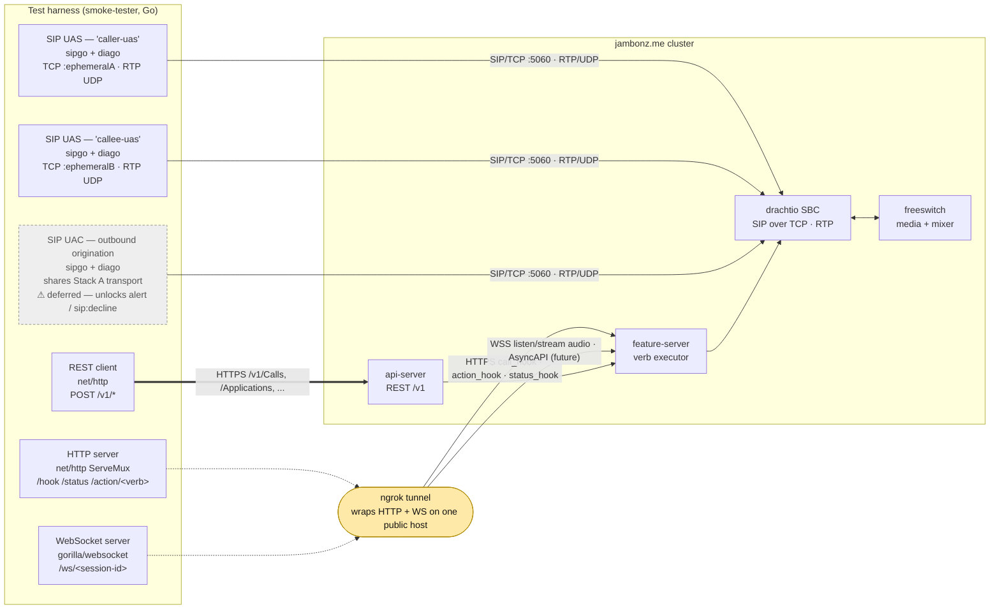

# Components & traffic

Top-level view of the harness ↔ jambonz.me interaction. Each component,
the stack it's built on, and which protocol it uses to talk to the jambonz
cluster.

## Diagram

## Components and protocols

### Harness-side components

| Component | Stack | Traffic | Used by |
|---|---|---|---|
| **SIP UAS — `caller-uas`** (Stack A) | `emiago/sipgo` + `emiago/diago`, ephemeral TCP port per test process | REGISTER + SIP/TCP, RTP/UDP | Every single-leg verb test; caller leg for multi-leg tests (`dial`, `conference`, `enqueue`) |
| **SIP UAS — `callee-uas`** (Stack B) | Same as A, second stack on a different ephemeral TCP port | REGISTER + SIP/TCP, RTP/UDP | Callee leg for multi-leg verb tests; idle on single-leg tests |
| **SIP UAC** (deferred) | Shares Stack A's transport | SIP/TCP, RTP/UDP | Reserved for outbound-origination tests — unlocks `alert`, `sip:decline`. Not wired into `tests/verbs/` yet |
| **HTTP server** | stdlib `net/http` ServeMux; `internal/webhook` | Serves `/hook`, `/status`, `/action/<verb>`, `/health` on loopback | Every webhook-driven (Phase-2) test |
| **WebSocket server** | `gorilla/websocket`; `internal/webhook/ws.go` | Session-routed `/ws/<session-id>`; text + binary frames | `listen` / `stream` today; future: AsyncAPI jambonz-WS, bidirectional `llm`/`agent` |
| **REST client** | stdlib `net/http`; `internal/provision` | HTTPS to `/v1/Calls`, `/Applications`, `/Accounts/...`, etc. | All tests that originate calls via `POST /Calls`; Tier 1–2 REST tests |
| **ngrok tunnel** | `ngrok/ngrok-go`; `internal/webhook/tunnel.go` | One public host carries both HTTPS (for HTTP server) and WSS (for WebSocket server) | All Phase-2 tests. Unset `NGROK_AUTHTOKEN` → Phase-2 tests skip cleanly |
| **Contract validator** | `santhosh-tekuri/jsonschema/v5`; `internal/contract` | Validates every inbound REST response and webhook body | Cross-cutting: runs inside the REST client and webhook server |
| **Deepgram STT** | `deepgram/deepgram-go-sdk/v3`; `internal/stt` | HTTPS to `api.deepgram.com` with linear16/8kHz | Post-call assertion for every audio-bearing test (say, play, gather_speech, dial, conference, enqueue, transcribe) |

### Jambonz-side components (the cluster we're testing)

| Component | What it does | We talk to it via |
|---|---|---|
| **drachtio SBC** | SIP edge — handles INVITE/ACK/BYE routing, RTP passthrough | Our UASes and UAC reach it on `sip.jambonz.me:5060` over TCP |
| **feature-server** | Executes verb scripts; invokes hooks | It calls us (through ngrok) for `call_hook`/`action_hook`/`call_status_hook` and for `listen`/`stream` WS audio |
| **api-server** | REST API | Our REST client POSTs `/Calls`, `/Applications`, etc. |
| **freeswitch** | Media (mixer, bridge, DTMF, recording) | Indirect — feature-server drives it; we observe effects through SIP + RTP |

## Traffic summary

| Direction | Protocol | From → To |
|---|---|---|
| Harness REST client → api-server | **HTTPS** | Outbound only; no tunnel needed |
| Harness UAS/UAC ↔ SBC | **SIP over TCP + RTP over UDP** | Registered connection from our ephemeral ports to `sip.jambonz.me` |
| Feature-server → Harness HTTP hooks | **HTTPS** (via ngrok) | `call_hook`, `action_hook`, `call_status_hook`, verb-specific hooks |
| Feature-server → Harness WS | **WSS** (via ngrok) | `listen`/`stream` binary audio + JSON metadata; future AsyncAPI |
| Harness STT helper → Deepgram | **HTTPS** | Post-call transcript check |

## Stack assignment per test shape

- **Single-leg verb test** (say, play, hangup, …): Stack A UAS only.
- **Multi-leg verb test** (dial, conference, enqueue/dequeue): Stack A UAS as caller, Stack B UAS as callee, jambonz bridges.
- **UAC origination test** (alert, sip:decline — *deferred*): Stack A UAC dials a jambonz-served URI; no Stack B.
- **Phase-2 webhook test** (gather, tag, redirect, config, dub, sip:*, listen, stream, transcribe, conference, enqueue, leave, message): ngrok tunnel is mandatory; Stack A (+ optionally B) involved depending on whether the verb is multi-leg.
